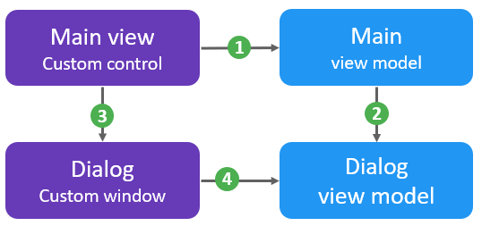
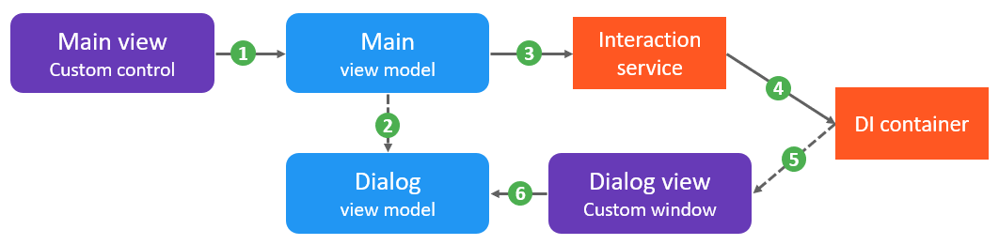

# Introduction

In the past two years I've come to appreciate [ReactiveUI](https://github.com/reactiveui/ReactiveUI) a lot for a large desktop application using WPF Core. Splitting the front-end into views and view models makes the application unit-testable: Although the views (custom controls) depend on WPF technology, the view models do not. I can easily test if the view model correctly responds to changes in the data layer and if user interactions (changing property values, invoking commands) trigger the right logic.

One downside in my opinion is the pattern used for [interactions](https://reactiveui.net/docs/handbook/interactions/). Often these interactions represent something the user needs to do, in order to provide input to the view model. Dialogs are a common way to handle these interactions: For example, to enter a new name for a selected object or for picking a file that must be imported. 

# The ReactiveUI approach to interactions

In the picture, I'm showing the dependencies.
1) The view is dependent on the view model as usual. 
2) The view model exposes an interaction. This interaction may use a simple input and outputtype, but more typically references another view model.
3) The view is responsible for attaching a handler to the interaction. For this, a custom dialog window is used.
4) The dialog uses the interaction view model.



Using this approach to interactions makes the view not just responsible for *handling* the interaction but also for *registering handlers* to the interaction. Such a handler must be registered for *each* instance of the view model - even if many different instances of many view model types would use the same type of interaction. If the view model would be shown in two different views, it's not clear which one is responsible for attaching the handler. Finally, when unit testing, one needs to make sure a mock handler is attached to each interaction as well.

# Mediator pattern to the rescue

Ideally:
- We only register each interaction handler once, in a central place.
- The main view does not depend on the dialog view or view model.
- The main view model would still not know how the interaction is handled.

The [mediator pattern](https://en.wikipedia.org/wiki/Mediator_pattern) can solve the third requirement: We can use a library like [MediatR](https://github.com/jbogard/MediatR) to handle an interaction view model and return a result after the user has completed the interaction. Because it uses [dependency injection](https://en.wikipedia.org/wiki/Dependency_injection), we also solve the first requirement: The DI container is the central place containing the interaction handlers. And this means individual view instances do not need to know about the interaction anymore, solving the second requirement.

The picture illustrates this. 
1) The view still depends on the view model, but does not reference the dialog view anymore.
2) The view model uses the dialog view model to construct input to the view model as before.
3) The view model calls the interaction service and passes the interaction view model.
4) The interaction service implements (or uses) the mediator pattern and retrieves a handler from the dependency injection container.
5) The dependency injection container knows that the dialog view can be used to handle the given interaction.
6) The dialog view still knows about the corresponding view model.

As I will show below, the second dependency can often be removed. Common interactions can be encapsulated in the interaction service (or an extension method for that service), including the construction of the corresponding view model.



# Simple MediatR-based implementation in C#

I've implemented the above approach in a very simple [C# library](https://github.com/ronaldvdv/LightImage.Interactions) which is also available on [NuGet](https://www.nuget.org/packages/LightImage.Interactions/). Below I will introduce the main building blocks and the steps required to use the approach outlined above. More information can be found in the GitHub repository.

Each input to an interaction shall be represented by a class implementing `IInteractionInput<T>` below. Although a scalar or struct input might suffice for simple interactions, using the interface is required for using MediatR.

```csharp
public interface IInteractionInput<out TOutput> : IRequest<TOutput>
{
}
```

Then, there's the `IInteractionService`. It has a single responsibility: Handling an interaction and returning the expected output. I'm using a `Task<T>` result type to allow for async interactions. The actual implementation of this interface simply forwards calls to the `IMediator`.

```csharp
public interface IInteractionService
{
    Task<TOutput> Show<TInput, TOutput>(TInput input)
        where TInput : IInteractionInput<TOutput>;
}
```

So now we can inject the `IInteractionService` into any view model that needs to use interactions. For each interaction we instantiate a subclass of the `IInteractionInput<T>` and get a `Task<T>` as a result. However, since MediatR is now handling the interactions, the dependency container used by its `IMediator` implementation must contain the handlers.

An interaction handler implements the following simple interface, which is a simple specialization of the `IRequestHandler<,>` found in MediatR restricting its input to be an interaction type:

```csharp
public interface IInteractionHandler<in TInput, TOutput> : IRequestHandler<TInput, TOutput>
    where TInput : IInteractionInput<TOutput>
{
}
```

# Adding common interaction types

The application from which the interaction logic above is extracted, had a few common types of interaction that I believe are generally useful: Selecting a file, showing an information message, prompting the user for some input or choice. Instead of constructing input view models for these interactions, it would be more convenient to have these interactions available as methods on the `IInteractionService`.

For example, the extension method for showing a message looks like this:

```csharp
public static Task<MessageButton> ShowMessage(this IInteractionService service, string title, string message, MessageIcons icon = MessageIcons.Information, MessageButton button = MessageButton.Ok)
{
    var options = new MessageOptions
    {
        Icon = icon,
        Title = title,
        Message = message,
        Buttons = button
    };
    return service.ShowMessage(options);
}
```

The method uses `MessageOptions` class which implements `IInteractionInput<MessageResult>`. The input contains the properties listed above; the output looks as follows:

```csharp
public class MessageResult
{
    public MessageResult(MessageButton button)
    {
        Button = button;
    }

    public MessageButton Button { get; }
}
```

On top of the above method, convenience wrappers can be added easily:

```csharp
public static async Task<bool> YesNo(this IInteractionService service, string title, string message, MessageIcons icon = MessageIcons.Question)
{
    var result = await service.ShowMessage(title, message, icon, MessageButton.Yes | MessageButton.No);
    return result == MessageButton.Yes;
}
```

# Adding handlers for WPF

Now the only thing we miss is quite esssential - the actual handlers. Since the message box interaction is very similar to the input/prompt interaction, the easiest thing to do is create a single `Window` which implements both `IInteractionHandler<MessageOptions, MessageResult>` and `IInteractionHandler<PromptOptions, PromptResult>`. Each `Handle()` method configures the buttons and labels, shows the dialog and returns the selected button.

To make the interaction asynchronous, we need a small method `Window.ShowDialogAsync()`:

```csharp
public static Task<bool?> ShowDialogAsync(this Window self)
{
    if (self == null) throw new ArgumentNullException("self");

    var completion = new TaskCompletionSource<bool?>();
    self.Dispatcher.BeginInvoke(new Action(() => completion.SetResult(self.ShowDialog())));
    return completion.Task;
}
```

For selecting files, there are the `OpenFileInput` and `SaveFileInput` view models and corresponding `OpenFileResult` and `SaveFileResult` classes. These can be simply handled by standard Windows dialogs, as follows:

```csharp
public class FileInteractionHandler :
    IInteractionHandler<OpenFileInput, OpenFileOutput>,
    IInteractionHandler<SaveFileInput, SaveFileOutput>
{
    public Task<OpenFileOutput> Handle(OpenFileInput request, CancellationToken cancellationToken)
    {
        var dialog = new OpenFileDialog { Multiselect = request.MultiSelect, CheckFileExists = true };
        Initialize(dialog, request);
        var ok = dialog.ShowDialog();
        var result = ok == true ? dialog.FileNames.Select(f => new FileInfo(f)).ToArray() : null;
        return Task.FromResult(new OpenFileOutput(result));
    }

    public Task<SaveFileOutput> Handle(SaveFileInput request, CancellationToken cancellationToken)
    { // Similar to the above method }

    private static void Initialize<T>(FileDialog dialog, FileInput<T> input)
    {
        dialog.Title = input.Title;
        dialog.DefaultExt = input.DefaultExtension;
        dialog.Filter = input.Filter;
        dialog.FileName = input.Path;
    }
}
```

# Simplifying enumeration choices

Finally, a common scenario is for the user to choose one out of a series of options (or cancel the operation). The enumeration type itself cannot implement `IInteractionInput<T>` so we need a different type of view model. For this purpose, I added an `EnumViewModel` which is used as follows:

```csharp
public static async Task<TEnum?> Show<TEnum>(this IInteractionService service, string title, string message)
    where TEnum : struct, Enum
{
    var vm = EnumViewModel.Create<TEnum>(title, message);
    var result = await service.Show<EnumViewModel, EnumMemberViewModel>(vm);
    return (TEnum?)result?.Value;
}
```

The `Create`-method can be seen in the source code and simply iterates the enumeration members. `[Description]` and `[Display]` attributes can be used to define descriptions and labels. In the WPF-code I added a window that automatically adds radio buttons for each enum member.

# Testability

One of the reasons for investigating this approach to interactions, is testability. To make sure that view models which use interactions are easily testable, we need to be able to mock the `IInteractionService` with predefined results.

For this purpose, I added the `TestInteractionService` class. It basically contains a mapping of input types to functions that generate output values. New items can be registered as follows. The first method takes a function mapping inputs to outputs, to also allow for dynamic generation of result values based on input values. The other methods are convenience wrappers for functions independent of input, and constant results.

```csharp
private readonly Dictionary<Type, Func<object, object>> _results;

public void Setup<TInput, TOutput>(Func<TInput, TOutput> func) where TInput : IInteractionInput<TOutput>
{
    _results[typeof(TInput)] = o => func((TInput)o);
}

public void Setup<TInput, TOutput>(Func<TOutput> func) where TInput : IInteractionInput<TOutput>
{
    Setup<TInput, TOutput>(_ => func());
}

public void Setup<TInput, TOutput>(TOutput output) where TInput : IInteractionInput<TOutput>
{
    Setup<TInput, TOutput>(() => output);
}
```

For the most common interactions, I added convenience properties like this:

```csharp
public MessageButton ShowResult { get; set; } = MessageButton.Ok;
Setup<MessageOptions, MessageResult>(() => new MessageResult(ShowResult));
```

# Conclusion

In this article I've shown how to replace the interaction logic from the ReactiveUI framework by a mediator/DI-based approach. If you're interested in using it in your own applications, have a look at the  [C# library](https://github.com/ronaldvdv/LightImage.Interactions) which is also available on [NuGet](https://www.nuget.org/packages/LightImage.Interactions/) and let me know what you think!

